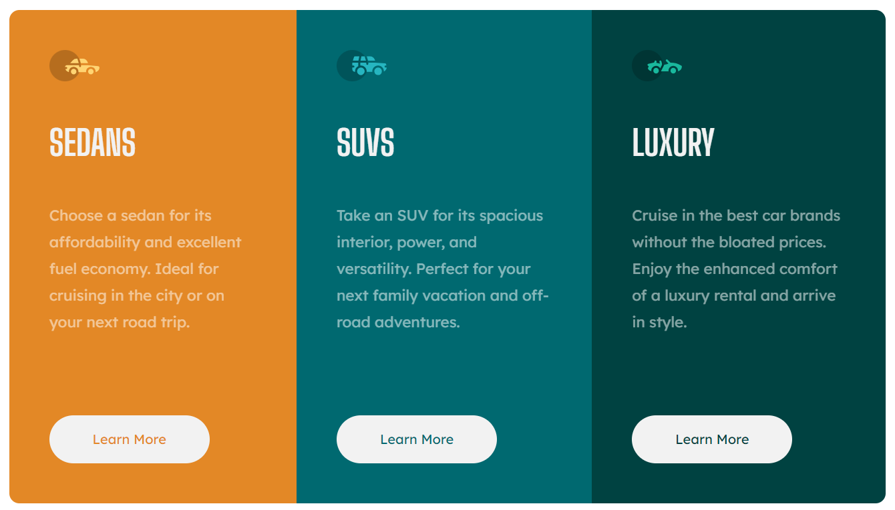
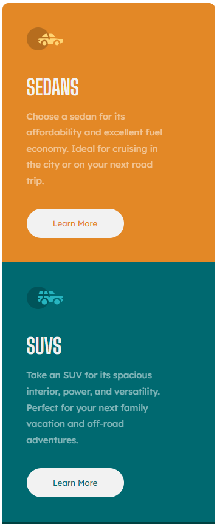

# Frontend Mentor - 3-column preview card component solution

This is a solution to the [3-column preview card component challenge on Frontend Mentor](https://www.frontendmentor.io/challenges/3column-preview-card-component-pH92eAR2-). Frontend Mentor challenges help you improve your coding skills by building realistic projects. 

## Table of contents

- [Overview](#overview)
  - [The challenge](#the-challenge)
  - [Screenshot](#screenshot)
  - [Links](#links)
- [My process](#my-process)
  - [Built with](#built-with)
  - [What I learned](#what-i-learned)
- [Author](#author)

## Overview

### The challenge

Users should be able to:

- View the optimal layout depending on their device's screen size
- See hover states for interactive elements

### Screenshot




### Links

- Solution URL: [Add solution URL here](https://github.com/ucolinmee/frontendmentor-3ColumnCard)
- Live Site URL: [Add live site URL here](https://ucolinmee.github.io/frontendmentor-3ColumnCard/)

## My process

### Built with

- Semantic HTML5 markup
- CSS custom properties
- Flexbox
- CSS Grid

### What I learned

This challenge was a good way for me to review my learning as well as to implement some of the "industry standard" code used. One such example of this was the following code added below to center my content both horizontally and vertically for all screen sizes, which was handy. 

```css
body {
  display: flex;
  min-height: 80vh;
  justify-content: center;
  align-items: center;
  font-size: 15px;
}
```

## Author

- Website - [Add your name here](https://www.your-site.com)
- Frontend Mentor - [@yourusername](https://www.frontendmentor.io/profile/yourusername)
- Twitter - [@yourusername](https://www.twitter.com/yourusername)
